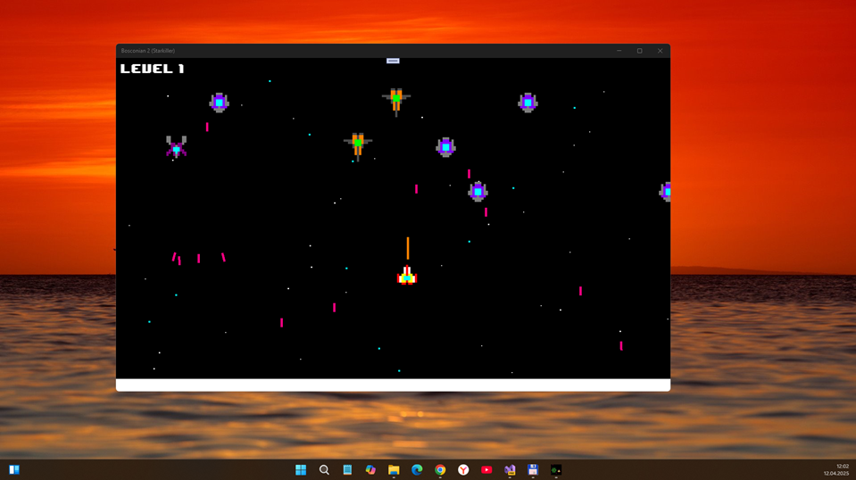
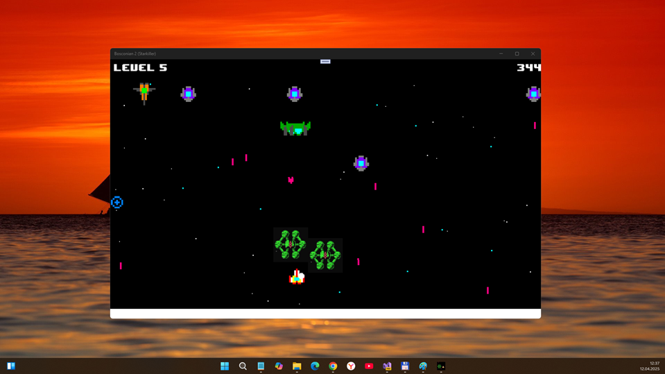
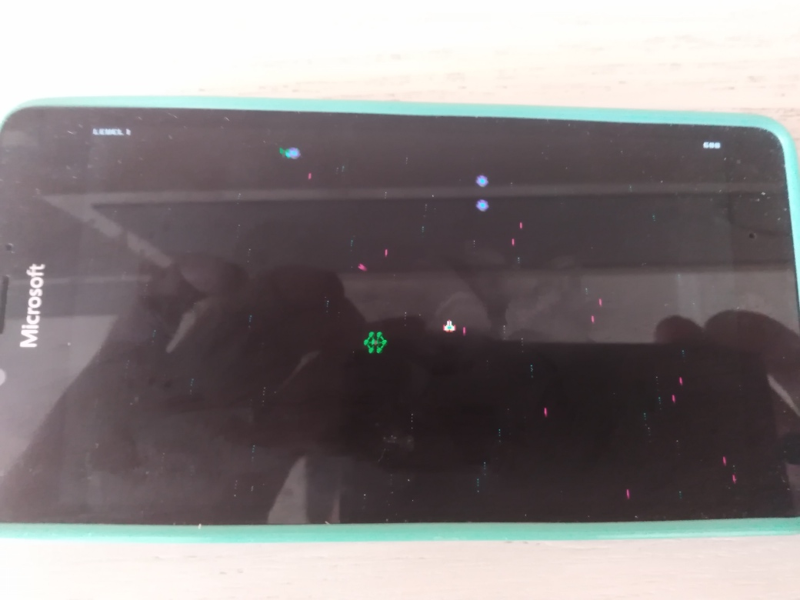

# Boscon2 (Starkiller codename) - uwp branch 

"UWP-Remake" of ITCH.io Starkiller shooter game. A true hardcore retro shoot 'em up experience! 

## About
"Shoot through endless waves of enemies in this retro-inspired space shoot em' up game! In each level you'll face a randomly generated group of enemies who can kill you with just one hit! But don't worry, you'll have plenty of power-ups to help you on your adventure. Are you prepared?"

## Screenshots

## Tech details
- My remake made:          April 12, 2025
- Original updated:	 Feb 20, 2023
- Original Published:	 Feb 12, 2016
- Status:	                 Released
- Platforms:	         Windows or Windows 10 Mobile
- Author of original:	 Marcos92
- Janre:	                 Shooter
- Builded with:	         MonoGame, XNA
- Labels: 2D, 8-Bit, Pixel Art, Procedural Generation, Retro, Roguelite, Shoot 'Em Up, Space, Top-Down
- Game session:	A few minutes
- Language(s):	English
- Game control:	Keyboard, Gamepad (any)
- It's only game template ("sketch") to simplify your own PC/OS-simulation game dev :)
- UWP app : Min Win. SDK is 10240, Main Win. SDK is 19041  

## Game control via Touch panel
- Mouse pointer "replication" (move left/right/up/down)
- Tap screen - enter or fire!

## ToDo
- Test game scaling on W10M
- Check touch control on any W10M device
- Repair save-game storage

## .
As is. No support. DIY. Learn purposes only.

## Reference(s)
https://marcos92.itch.io/starkiller Original project

## ..
[m][e] April 2025
